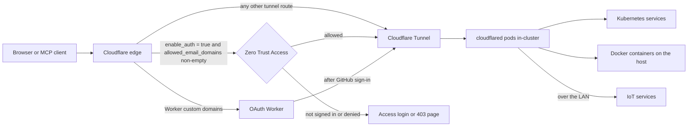

# Homelab Infrastructure

Terraform and Helm for the self-hosted services I run at home. The cluster is Docker Desktop's
Kubernetes; everything reachable from outside goes through a Cloudflare Tunnel, so no port is
forwarded and my home IP stays out of DNS. Certificates come from Cloudflare, and Zero Trust email
or Google sign-in sits in front of services that set `enable_auth = true`, once
`allowed_email_domains` is non-empty.

## Architecture

### Core components
- **Terraform**: Infrastructure as Code for managing Kubernetes resources
- **Helm**: Package manager for Kubernetes applications  
- **Cloudflare Tunnel**: Secure external access with automatic SSL certificates
- **cloudflared**: Tunnel client running in Kubernetes for secure connectivity
- **Docker Desktop**: Local Kubernetes cluster (context: `docker-desktop`)
- **Docker Volumes**: Managed persistent storage for applications

### How traffic reaches a service


Nothing listens on a forwarded port, so the home IP never appears in DNS. Certificates are issued
by Cloudflare rather than managed here. Zero Trust is per service, but Terraform creates a
service's Access application and email policy only when the service sets `enable_auth = true` and
`allowed_email_domains` is non-empty; `allowed_emails` alone is not enough. The OAuth Worker's
custom domains use the Worker's own GitHub sign-in instead of Access, and the Worker forwards only
authenticated requests to its backend.

### What is deployed

#### Kubernetes services
- **cloudflared**: Tunnel client for secure connectivity
- **PostgreSQL**: Database service for applications
- **MinIO**: S3-compatible object storage for files and backups
- **Open WebUI**: AI chat interface
- **n8n**: Workflow automation platform

#### Docker containers on the host
- **Calibre Web**: Ebook server and manager
- **Whisper STT**: OpenAI-compatible speech-to-text API (faster-whisper)
- **Docker Proxy**: Secure Docker socket access

Which of these the tunnel exposes is set per route in `locals.tf`, not by where a service runs. The
tunnel also routes to a few IoT services on the LAN, Homepage among them, that are deployed outside
this repo.

## Quick start

### Prerequisites
- **Docker Desktop** with Kubernetes enabled
- **Terraform** >= 1.0
- **kubectl** configured with docker-desktop context
- **Domain** managed by Cloudflare
- **Cloudflare account** (free tier supported)

### Installation

1. **Clone the repository**
   ```bash
   git clone <repository-url>
   cd rainforest-homelab
   ```

2. **Get Cloudflare credentials**
   
   **API Token** (https://dash.cloudflare.com/profile/api-tokens):
   - Click "Create Token" → "Custom token"
   - Permissions required:
     - `Zone: Zone: Read`
     - `Zone: DNS: Edit`
     - `Account: Cloudflare Tunnel: Edit`
     - `Account: Access: Apps and Policies: Edit`
     - `Account: Access: Organizations, Identity Providers, and Groups: Edit`
   - Zone Resources: Include your domain
   - Account Resources: Include your account
   
   **Account ID**: 
   - Go to your domain dashboard
   - Copy "Account ID" from right sidebar

3. **Configure environment**
   ```bash
   cp terraform.tfvars.example terraform.tfvars
   # Edit terraform.tfvars with your Cloudflare credentials and domain
   ```

4. **Deploy infrastructure (2-step process)**
   
   **Step 1: Basic tunnel setup**
   ```bash
   terraform init
   terraform plan
   terraform apply
   ```
   
   **Step 2: Enable Zero Trust authentication (optional)**
   - Go to https://dash.cloudflare.com/ → Zero Trust → Settings
   - Enable "Access" (requires billing info, but Zero Trust is free for up to 50 users)
   - Update `terraform.tfvars` with your allowed email domains:
     ```hcl
     allowed_email_domains = ["gmail.com"]  # or your company domain
     ```
   - Deploy authentication:
     ```bash
     terraform plan
     terraform apply
     ```

5. **Access your services**
   - Services will be available at `https://service-name.yourdomain.com`
   - DNS records and SSL certificates are automatically created
   - With Zero Trust: Services require email verification before access

## Configuration

### Required values
Configure your deployment by editing `terraform.tfvars`:

```hcl
# Environment Configuration
environment  = "dev"
project_name = "homelab"

# Infrastructure Configuration
kubernetes_context = "docker-desktop"
domain_suffix      = "yourdomain.com"  # Your Cloudflare-managed domain

# Cloudflare Configuration (REQUIRED)
cloudflare_account_id = "your-account-id"     # From Cloudflare dashboard
cloudflare_api_token  = "your-api-token"      # From API tokens page

# Feature Flags
enable_cloudflare_tunnel = true   # Enable Cloudflare Tunnel
enable_postgresql        = true   # Deploy PostgreSQL database

# Zero Trust Authentication (OPTIONAL)
allowed_email_domains = ["gmail.com"]           # Email domains for access
allowed_emails        = ["user@example.com"]    # Specific emails for access

# Resource Sizing
default_cpu_limit    = "500m"
default_memory_limit = "1Gi"
default_storage_size = "10Gi"
```

### Feature flags
Control which services are deployed:
- `enable_cloudflare_tunnel`: Enable Cloudflare Tunnel for external access
- `enable_postgresql`: Deploy PostgreSQL database
- `enable_minio`: Deploy MinIO S3-compatible object storage
- `enable_docker_mcp_gateway`: Deploy Docker MCP Gateway for remote Docker operations
- `enable_coredns`: Legacy Tailscale integration (disabled when using tunnel)
- `enable_traefik`: Legacy ingress controller (disabled when using tunnel)

### Zero Trust authentication, in two passes

**Step 1: Basic deployment** (no authentication)
- Deploy with empty `allowed_email_domains = []`
- Services are publicly accessible via HTTPS

**Step 2: Enable authentication** (optional but recommended)
1. **Enable Cloudflare Access** at https://dash.cloudflare.com/ → Zero Trust → Settings
   - Requires adding billing info (Zero Trust is free for up to 50 users)
2. **Configure email domains** in `terraform.tfvars`:
   ```hcl
   allowed_email_domains = ["yourdomain.com"]  # Email domain for your team
   allowed_emails        = ["user@gmail.com"]  # Additional specific emails
   ```
3. **Redeploy authentication**: `terraform apply`

### Google SSO

To offer Google sign-in instead of (or alongside) email OTP:

1. Create an OAuth 2.0 app at [console.cloud.google.com](https://console.cloud.google.com):
   - **APIs & Services → Credentials → Create Credentials → OAuth 2.0 Client ID**
   - Application type: **Web application**
   - Authorized redirect URI: `https://<team-name>.cloudflareaccess.com/cdn-cgi/access/callback`
   - Copy the Client ID and Client Secret
2. Add to `terraform.tfvars`:
   ```hcl
   google_oauth_client_id     = "your-client-id.apps.googleusercontent.com"
   google_oauth_client_secret = "your-client-secret"
   ```
3. Run `terraform apply` — Google SSO will appear on all Zero Trust login pages
4. If the Google app is in **test mode**, add each user at: APIs & Services → OAuth consent screen → Test users

### Per-service access control

Each service in `locals.tf` supports an optional `allowed_emails` field for granting access to specific users without giving them global access:

```hcl
"my-service" = {
  hostname       = "my-service"
  service_url    = "http://host.docker.internal:8080"
  enable_auth    = true
  type           = "docker"
  allowed_emails = ["guest@gmail.com"]  # only this user + global allowed_emails/domains
}
```

Global access is controlled via `allowed_email_domains` and `allowed_emails` in `terraform.tfvars`.

## Reaching the services

### Kubernetes services, through the tunnel
These services are accessible globally with automatic HTTPS certificates:

- **🏠 https://homepage.yourdomain.com** - Homepage dashboard with all services
- **🌐 https://open-webui.yourdomain.com** - Open WebUI AI chat interface
- **🔄 https://flowise.yourdomain.com** - Flowise AI workflow builder  
- **⚡ https://n8n.yourdomain.com** - n8n automation platform
- **🐳 https://docker-mcp.yourdomain.com** - Docker MCP Gateway for remote Docker operations (optional)

### What the tunnel gives you
- **Real SSL Certificates**: Automatic and trusted certificates from Cloudflare
- **Hidden Home IP**: Your public IP is never exposed 
- **Global CDN**: Fast access from anywhere via Cloudflare's network
- **DDoS Protection**: Enterprise-grade protection included
- **Zero Trust Ready**: Optional email authentication

### Access from anywhere
- **No VPN required**: Services accessible from any internet connection
- **Mobile friendly**: Works on phones, tablets, laptops
- **Office networks**: Bypasses most corporate firewalls
- **Travel friendly**: Same URLs work globally

### Docker containers, direct HTTP
These services run as Docker containers with direct port access:

- **📚 http://localhost:8083** - Calibre Web ebook server
- **🚀 http://localhost:3333** - OpenSpeedTest network testing
- **🔧 http://localhost:2375** - Docker Proxy (internal use)

## Docker MCP gateway

The Docker MCP Gateway provides **remote Docker operations** via the Model Context Protocol (MCP), enabling secure container management from anywhere.

### What it does
- **Remote Docker Control**: Manage containers from any MCP-compatible client
- **OAuth Authentication**: GitHub sign-in through the OAuth Worker, not Zero Trust Access
- **132+ Tools**: Includes GitHub, Terraform, Obsidian, Playwright, and Sequential Thinking tools
- **Streamable HTTP**: single-transport gateway; `--transport` takes one value, so SSE is not served concurrently
- **Claude Compatible**: Works with Claude web, desktop, and mobile apps

### Using it
1. **OAuth-Protected (Recommended)**: `https://docker-mcp.rainforest.tools/mcp`
2. **Local Development**: `http://localhost:3101/mcp` (bypasses authentication)

### OAuth setup with Wrangler

The OAuth Worker is a Wrangler project in `workers/oauth-gateway/`. Wrangler deploys the Worker,
its KV namespace binding and its secrets. Terraform does only one part: `modules/oauth-worker/`
creates the `cloudflare_workers_domain` bindings that attach the Worker's custom domains, such as
`docker-mcp.yourdomain.com`. Deploy the Worker first, then run Terraform.

1. Create a GitHub OAuth app with the callback URL `https://docker-mcp.yourdomain.com/callback`, and
   copy its client ID and secret.

2. In `workers/oauth-gateway/`, install dependencies and create the KV namespace:
   ```bash
   npm install
   npx wrangler kv namespace create OAUTH_KV
   ```
   Then edit `wrangler.jsonc`:
   - set `account_id`, and put the new namespace ID in the `OAUTH_KV` binding
   - set `GITHUB_CALLBACK_URL` and `ALLOWED_GITHUB_LOGINS` under `vars`; if
     `ALLOWED_GITHUB_LOGINS` is empty, any GitHub account can sign in
   - keep `name` as `<project_name>-oauth-gateway`, the Worker the Terraform bindings point at

3. Set the secrets and deploy:
   ```bash
   npx wrangler secret put GITHUB_CLIENT_ID
   npx wrangler secret put GITHUB_CLIENT_SECRET
   npx wrangler secret put COOKIE_ENCRYPTION_KEY   # any random string, e.g. openssl rand -hex 32
   npm run deploy
   ```

4. From the repo root, create the custom domain bindings. The Terraform API token needs
   Cloudflare Workers:Edit for this.
   ```bash
   terraform plan
   terraform apply
   ```

5. Point MCP clients at `https://docker-mcp.yourdomain.com/mcp`.

#### How the OAuth worker fits in

The code is in `workers/oauth-gateway/`, a TypeScript project with its entry point at
`src/index.ts`. The Worker:
- acts as the OAuth 2.1 server for MCP clients, including dynamic client registration
- signs the user in with GitHub and keeps grants and tokens in Cloudflare KV
- forwards authenticated MCP requests to its backend, the Docker MCP Gateway by default

#### Using it after deploying

- URL: `https://docker-mcp.yourdomain.com/mcp`
- Sign-in: the client runs the OAuth flow, and you sign in with GitHub
- Configuration: `wrangler.jsonc` and Wrangler secrets for the Worker; Terraform only for the
  domain bindings

### Security considerations

⚠️ **Docker Socket Access**: The Docker MCP Gateway requires Docker socket access, providing significant privileges:
- Container management capabilities
- Image operations (pull, build, push)
- Potential host filesystem access
- Privilege escalation possibilities

**Security Mitigations**:
- Deploy only in trusted environments
- Use OAuth authentication (see setup above)
- Monitor container activities via logs
- Network isolation via Docker networks
- Resource limits and health checks

### Management interfaces
Access administrative interfaces:

- **☁️ Cloudflare Dashboard**: https://dash.cloudflare.com/
- **🗄️ PostgreSQL**: Access via kubectl (see management section below)

## Day-to-day operations

### Terraform
```bash
# Plan infrastructure changes
terraform plan

# Apply changes
terraform apply

# Destroy infrastructure
terraform destroy

# Format and validate
terraform fmt
terraform validate
```

### Kubernetes
```bash
# Check cluster context
kubectl config current-context

# View running services
kubectl get pods -n homelab
kubectl get services -n homelab

# Check cloudflared tunnel status
kubectl get pods -n homelab -l app=cloudflared
kubectl logs -n homelab -l app=cloudflared

# View tunnel configuration
kubectl get configmap -n homelab cloudflared-config -o yaml
```

### Cloudflare Tunnel
```bash
# Check tunnel connectivity
kubectl logs -n homelab -l app=cloudflared --tail=20

# Test service connectivity (internal)
kubectl run test-pod --rm -it --restart=Never --image=curlimages/curl -- curl -I http://homelab-homepage.homelab.svc.cluster.local:3000

# View tunnel metrics (if enabled)
kubectl port-forward -n homelab -l app=cloudflared 2000:2000
# Then visit http://localhost:2000/metrics
```

### Docker volumes
```bash
# List all project volumes
docker volume ls --filter label=project=homelab

# Inspect a specific volume
docker volume inspect homelab-calibre-web-config

# Backup a volume
docker run --rm -v homelab-calibre-web-config:/data -v $(pwd):/backup alpine tar czf /backup/calibre-config-backup.tar.gz -C /data .

# Restore a volume
docker run --rm -v homelab-calibre-web-config:/data -v $(pwd):/backup alpine tar xzf /backup/calibre-config-backup.tar.gz -C /data
```

### PostgreSQL
```bash
# Get PostgreSQL password
echo $(kubectl get secret --namespace homelab homelab-postgresql -o jsonpath="{.data.postgres-password}" | base64 --decode)

# Connect to PostgreSQL
kubectl run postgresql-client --rm --tty -i --restart='Never' --namespace homelab --image docker.io/bitnami/postgresql:15 --env="PGPASSWORD=$(kubectl get secret --namespace homelab homelab-postgresql -o jsonpath="{.data.postgres-password}" | base64 --decode)" --command -- psql --host homelab-postgresql --username postgres --dbname homelab --port 5432
```

### MinIO object storage

**Web Console**: Access via `https://minio.yourdomain.com` (configured in Cloudflare Tunnel)

**S3 API Endpoint**: Access via `https://s3.yourdomain.com` for S3-compatible applications

```bash
# Get MinIO credentials
kubectl get secret --namespace homelab homelab-minio -o jsonpath="{.data.root-user}" | base64 --decode; echo
kubectl get secret --namespace homelab homelab-minio -o jsonpath="{.data.root-password}" | base64 --decode; echo

# MinIO client configuration (mc)
mc alias set homelab https://s3.yourdomain.com <access-key> <secret-key>

# Create a bucket
mc mb homelab/my-bucket

# Upload files
mc cp /path/to/file homelab/my-bucket/

# List buckets
mc ls homelab/
```

**For Applications**: Use S3-compatible SDKs with:
- **Endpoint**: `https://s3.yourdomain.com`
- **Access Key**: Retrieved from Kubernetes secret
- **Secret Key**: Retrieved from Kubernetes secret
- **Region**: `us-east-1` (default)

## Project structure

```
.
├── main.tf                    # Main Terraform configuration
├── variables.tf               # Variable definitions
├── outputs.tf                 # Output definitions
├── versions.tf                # Provider configurations
├── terraform.tfvars          # Environment-specific values
├── terraform.tfvars.example  # Example configuration
├── CLAUDE.md                  # AI assistant guidance
└── modules/
    ├── volume-management/     # Docker volume management
    ├── cloudflare-tunnel/     # Cloudflare Tunnel for external access
    ├── postgresql/           # PostgreSQL database
    ├── minio/                # MinIO S3-compatible object storage
    ├── calibre-web/          # Calibre Web ebook server
    ├── open-webui/           # Open WebUI interface
    ├── flowise/              # Flowise AI workflows
    ├── n8n/                  # n8n automation
    ├── homepage/             # Homepage dashboard
    ├── openspeedtest/        # Network speed testing
    ├── traefik/              # Legacy Traefik ingress (disabled)
    ├── coredns/              # Legacy CoreDNS (disabled)
    └── nfs-persistence/      # NFS storage (disabled)
```

### Module layout
Each module follows a standardized structure:
- `main.tf`: Main resource definitions
- `variables.tf`: Input variables with defaults
- `outputs.tf`: Output values for resource information
- `versions.tf`: Provider version constraints (where needed)

## Security model

- **Cloudflare Tunnel**: Zero trust network access with hidden home IP
- **Automatic SSL**: Real certificates from Cloudflare with perfect forward secrecy
- **DDoS Protection**: Enterprise-grade protection via Cloudflare's global network
- **Zero Trust Ready**: Email-based authentication for sensitive services
- **Docker Socket Proxy**: Secure Docker socket access for containers
- **Resource Limits**: CPU and memory limits for all services
- **Volume Management**: Isolated persistent storage with labels
- **Network Policies**: Kubernetes namespace isolation
- **Credential Security**: API tokens and secrets encrypted in Kubernetes

## Adding to it

### Adding a new service
1. Create new module directory in `modules/[service-name]/`
2. Create standardized module files:
   - `main.tf`: Main resource definitions
   - `variables.tf`: Standard variables (project_name, environment, etc.)
   - `outputs.tf`: Resource outputs including service_url
   - `versions.tf`: Provider constraints (if needed)
3. Add service to main `main.tf` as a module with standard variables
4. **Add ingress rule in `modules/cloudflare-tunnel/main.tf`** to the tunnel configuration
5. **Add DNS record in `modules/cloudflare-tunnel/main.tf`** to the services list
6. **Add Zero Trust app in `modules/cloudflare-tunnel/main.tf`** for authentication (optional)
7. For persistent storage, use the `volume-management` module
8. Run `terraform plan` and `terraform apply`

Note: New services automatically get SSL certificates and DNS records via Cloudflare

### Variable conventions
All modules use standardized variables:
- `project_name`: Project name for resource naming
- `environment`: Environment (dev/staging/prod)
- `namespace`: Kubernetes namespace
- `cpu_limit` / `memory_limit`: Resource limits
- `enable_persistence`: Enable persistent storage
- `storage_size`: Storage size for persistent volumes

## License

This project is licensed under the MIT License - see the LICENSE file for details.

## Contributing

1. Fork the repository
2. Create a feature branch
3. Make your changes
4. Test with `terraform plan`
5. Submit a pull request

## Reporting a vulnerability

This repository follows security best practices for infrastructure code. Please review:
- [`SECURITY.md`](SECURITY.md) - Comprehensive security guidelines
- Never commit sensitive data (API keys, passwords, tokens)
- Use `terraform.tfvars.example` as a template for your local configuration

## Support

For issues and questions:
- Check the `CLAUDE.md` file for AI assistant guidance
- Review Terraform documentation
- Check service-specific documentation in module directories
- For security concerns, see [`SECURITY.md`](SECURITY.md)