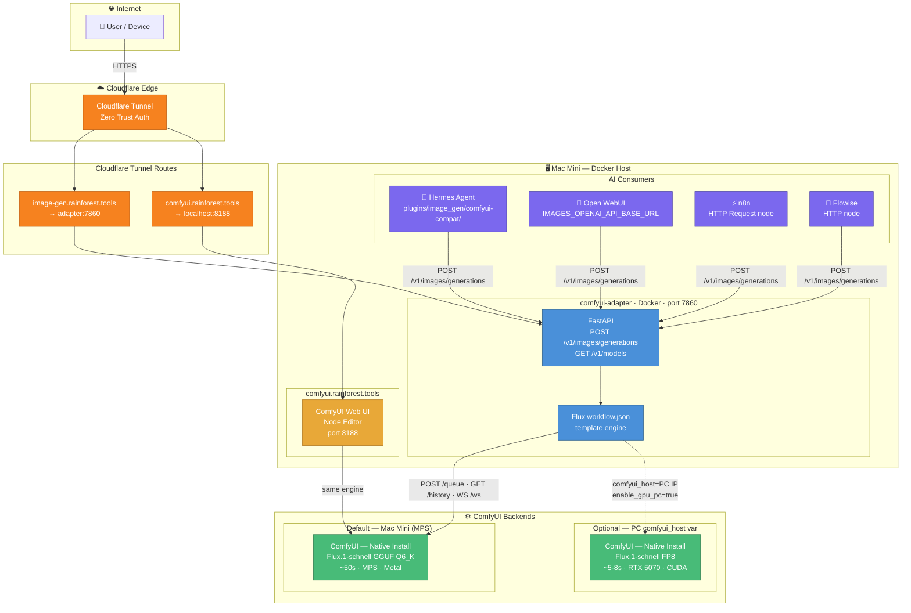

# Image Generation Service Design

**Date**: 2026-05-25  
**Status**: Approved  
**Topic**: Self-hosted image generation (Flux / ComfyUI) with unified OpenAI-compatible API layer

---

## Problem Statement

Add image generation to the homelab with a single shared model instance. Multiple consumers — Hermes Agent, Open WebUI, n8n, Flowise — must all call one endpoint rather than each running their own model.

---

## Architecture

### System Diagram



---

## Components

### 1. ComfyUI (native install — not Docker)

Docker containers on macOS cannot access Metal/MPS — they run in a Linux VM with no Apple GPU access. ComfyUI must be installed natively on the Mac Mini, exactly like Ollama.

- **Port**: 8188
- **Exposed via**: `comfyui.rainforest.tools` (Cloudflare Tunnel, Zero Trust auth)
- **Not managed by Terraform** — manual install, like Ollama

**Installation** (Mac Mini):
```bash
# Install ComfyUI natively
git clone https://github.com/comfyanonymous/ComfyUI
cd ComfyUI
pip install torch torchvision torchaudio  # PyTorch nightly for MPS
pip install -r requirements.txt

# Install ComfyUI-GGUF extension for GGUF model support
cd custom_nodes
git clone https://github.com/city96/ComfyUI-GGUF

# Install ComfyUI-MLX extension for 30-40% Apple Silicon speedup (optional)
git clone https://github.com/apple/ml-stable-diffusion  # MLX backend

# Start
python main.py --listen 0.0.0.0 --port 8188
```

**Model** (Mac Mini — MPS):
```bash
# Download Flux.1-schnell GGUF Q6_K (~7GB, fits in 16GB unified memory)
# Place in ComfyUI/models/unet/
huggingface-cli download city96/FLUX.1-schnell-gguf \
  flux1-schnell-Q6_K.gguf \
  --local-dir ./models/unet/
```

**Model** (PC — RTX 5070 CUDA):
```bash
# Flux.1-schnell FP8 (~12GB VRAM)
huggingface-cli download black-forest-labs/FLUX.1-schnell \
  flux1-schnell.safetensors \
  --local-dir ./models/unet/
```

### 2. comfyui-adapter (Docker container)

Thin FastAPI service that wraps ComfyUI's native queue/history API into the OpenAI `/v1/images/generations` interface. All consumers call this single endpoint.

- **Port**: 7860
- **Exposed via**: `image-gen.rainforest.tools` (Cloudflare Tunnel, no Zero Trust — auth via API key header)
- **Managed by**: Terraform module `modules/comfyui-adapter/`

**Module structure** (mirrors Whisper):
```
modules/comfyui-adapter/
  main.tf          # Docker container resource
  variables.tf     # comfyui_host, api_key, port
  outputs.tf       # service_url, tunnel_service_url
  Dockerfile
  app/
    main.py        # FastAPI: /v1/images/generations → ComfyUI queue
    workflow.json  # Flux.1-schnell base workflow template
    pyproject.toml
```

**API contract**:
```
POST /v1/images/generations
{
  "prompt": "a red fox in a forest",
  "n": 1,
  "size": "1024x1024"   // maps to width/height in workflow
}

→ {
  "data": [{ "b64_json": "<base64>" }]
}
```

The adapter submits the workflow to `/queue`, subscribes to `/ws` for completion, then fetches the output image from `/history/{prompt_id}`.

### 3. Hermes Agent plugin

Uses the plugin system merged in [PR #13799](https://github.com/NousResearch/hermes-agent/pull/13799).

**Location** (inside Hermes Agent install):
```
plugins/image_gen/comfyui-compat/
  __init__.py    # ImageGenProvider subclass + register(ctx)
  plugin.yaml    # kind: backend, name: comfyui-compat
```

**`plugin.yaml`**:
```yaml
kind: backend
name: comfyui-compat
display_name: ComfyUI (self-hosted)
```

**`__init__.py`** (key methods):
```python
class ComfyUICompatProvider(ImageGenProvider):
    name = "comfyui-compat"

    def generate(self, prompt, aspect_ratio="1:1", **kwargs):
        resp = httpx.post(
            f"{self.config['base_url']}/v1/images/generations",
            json={"prompt": prompt, "size": _ratio_to_size(aspect_ratio)},
            headers={"Authorization": f"Bearer {self.config['api_key']}"},
        )
        b64 = resp.json()["data"][0]["b64_json"]
        path = save_b64_image(b64)
        return success_response(image=path, model="flux-schnell",
                                prompt=prompt, aspect_ratio=aspect_ratio,
                                provider=self.name)
```

**`~/.hermes/config.yaml`**:
```yaml
image_gen:
  provider: comfyui-compat
  comfyui_compat:
    base_url: https://image-gen.rainforest.tools/v1
    api_key: <your-api-key>
```

### 4. Open WebUI wiring

Add to `modules/open-webui/main.tf` env list:
```hcl
var.image_gen_url != "" ? [
  "IMAGES_OPENAI_API_BASE_URL=${var.image_gen_url}/v1",
  "IMAGES_OPENAI_API_KEY=${var.image_gen_api_key}",
  "ENABLE_IMAGE_GENERATION=true",
] : []
```

Add to `modules/open-webui/variables.tf`:
```hcl
variable "image_gen_url"     { default = "" }
variable "image_gen_api_key" { default = "homelab-internal" }
```

### 5. n8n / Flowise

No code changes needed — both support generic HTTP Request nodes pointing to any OpenAI-compatible endpoint:

```
URL:    https://image-gen.rainforest.tools/v1/images/generations
Method: POST
Body:   { "prompt": "{{ $json.prompt }}", "size": "1024x1024" }
```

---

## Terraform Changes

### `locals.tf` additions
```hcl
{
  "comfyui" = {
    hostname    = "comfyui"
    service_url = "http://host.docker.internal:8188"
    enable_auth = true
    type        = "docker"
  }
},

var.enable_comfyui_adapter ? {
  "image-gen" = {
    hostname    = "image-gen"
    service_url = "http://host.docker.internal:7860"
    enable_auth = false  # auth via API key header
    type        = "docker"
  }
} : {},
```

### `variables.tf` additions
```hcl
variable "enable_comfyui_adapter" {
  description = "Enable the ComfyUI OpenAI-compatible image generation adapter"
  type        = bool
  default     = true
}

variable "comfyui_host" {
  description = "ComfyUI backend URL. Override to PC IP for GPU mode."
  type        = string
  default     = "http://host.docker.internal:8188"
}
```

### `main.tf` addition
```hcl
module "comfyui_adapter" {
  count  = var.enable_comfyui_adapter ? 1 : 0
  source = "./modules/comfyui-adapter"

  project_name  = var.project_name
  environment   = var.environment
  comfyui_host  = var.comfyui_host
  external_port = 7860
}
```

---

## Flux Model Selection Guide

| Scenario | Model | Format | Speed | VRAM/RAM |
|---|---|---|---|---|
| Mac Mini default | Flux.1-schnell | GGUF Q6_K | ~50s | ~10GB unified |
| Mac Mini + MLX | Flux.1-schnell | GGUF Q6_K | ~30s | ~10GB unified |
| PC RTX 5070 fast | Flux.1-schnell | FP8 | ~5-8s | ~8GB VRAM |
| PC RTX 5070 quality | Flux.1-dev | FP8 | ~15-20s | ~12GB VRAM |

Switch to PC: set `comfyui_host = "http://<pc-ip>:8188"` in `terraform.tfvars`.

---

## Deployment Order

1. **Install ComfyUI natively on Mac Mini** — Python venv, port 8188, download Flux GGUF
2. **Run `terraform apply`** — deploys `comfyui-adapter` Docker container, adds Cloudflare Tunnel routes
3. **Configure Hermes Agent** — drop plugin files, set `config.yaml`
4. **Configure Open WebUI** — set `image_gen_url` in `terraform.tfvars`, re-apply
5. **Test** — `curl -X POST https://image-gen.rainforest.tools/v1/images/generations -d '{"prompt":"test"}'`

---

## Key Constraints

- **ComfyUI cannot run in Docker on Mac** — Metal/MPS is inaccessible from Linux containers. Native install only.
- **One ComfyUI instance is shared** — a long UI workflow job will block API calls. Acceptable for homelab.
- **Hermes plugin uses merged PR #13799 plugin system** — requires Hermes Agent ≥ the version that merged #13799.
- **Flux.1-dev requires non-commercial license** — use Flux.1-schnell for unrestricted use.
